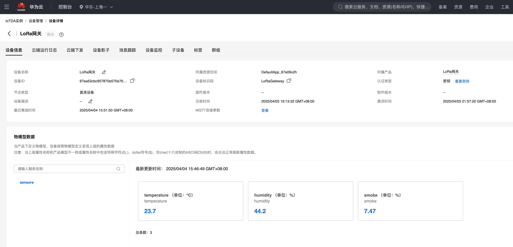

## 介绍

总共三个固件：网关板 GD32 固件，节点板 GD32 固件，4G 模块固件。

- 网关板 GD32 固件：通过 USART2 + DMA 空闲中断接收 LoRa 发送过来的数据
- 节点板 GD32 固件：通过 MCU unique_id 区分不同功能，并用 USART2 通过 LoRa 将数据发送给网关板
- 4G 模块固件：合宙 LuatOS 固件，基于 Lua，负责接收 GD32 的串口消息并解析为 json 文本，通过 4G MQTT 发送给华为云

## 通信协议

### 塔石 LoRa 模块

模块配置：

- 串口波特率：9600
- 发射频率：23 (433MHz)
- 接收频率：0x0A(网关), 0x0B(节点)
- 本机地址：0x0001(网关), 0x0002(MQ2所在节点), 0x0003(AHT10所在节点)
- 工作模式：定点传输模式

协议帧：

| 2 字节目标地址 | 1 字节目标信道(接收频率) | 数据 |
| :------------: | :----------------------: | :--: |

### 自定义协议

节点板发送传感器信息给网关板的简单协议

地址含义：

- 0x01：MQ2 烟雾浓度
- 0x02：AHT10 温度
- 0x03：AHT10 湿度

协议帧

| 1 字节地址 | 4 字节 IEEE745 浮点数(小端存储) |
| :--------: | :-----------------------------: |

### MQTTS

使用华为云作为 MQTT Broker，带 SSL 加密，数据格式为 json
```
Topic: $oc/devices/67ea52cbc957870e570e769f_LoRaGateway/sys/properties/report
```
```json
{
	"services": [{
		"service_id": "sensors",
		"properties": {
			"temperature": 23.7,
			"humidity": 44.2,
            		"smoke": 7.47
		}
	}]
}
```


