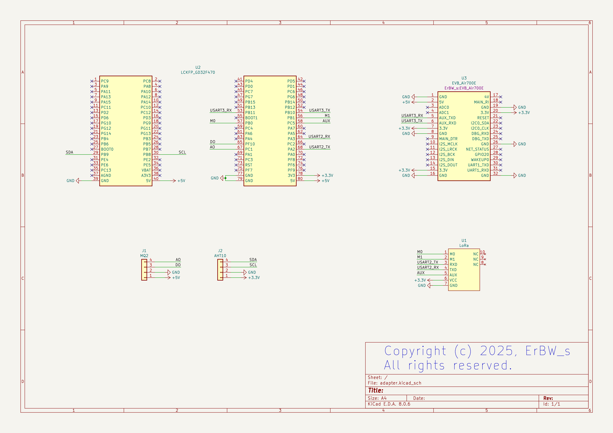
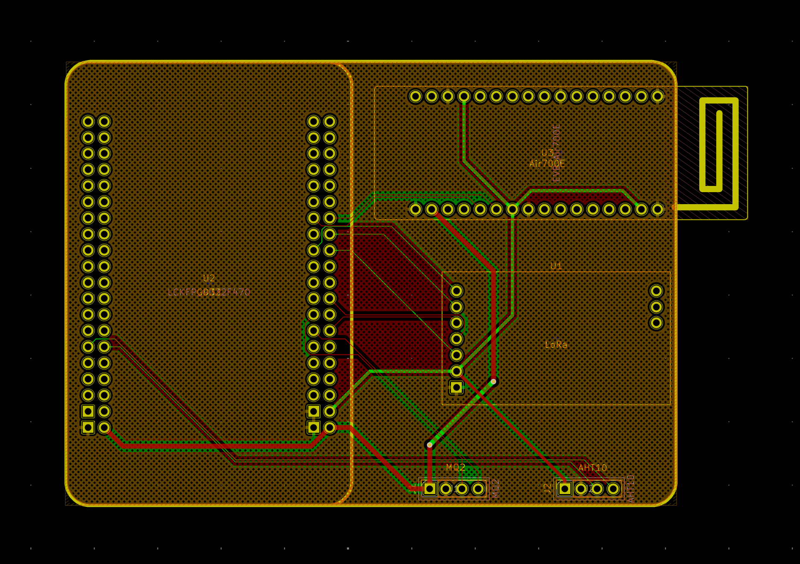

### 介绍

用 KiCad 画的转接板，集成了梁山派、Air700E 4G 模块，塔石 LoRa 模块及两个传感器接口。

- 网关板(1块PCB)：需要焊接梁山派、4G 模块和 LoRa 模块
- 节点板(2块PCB)：需要焊接梁山派、LoRa 模块和任意一个传感器接口

### 原理图与 PCB

### 焊接实物

|       网关板(编号1)       |       节点板(编号2)       |       节点板(编号3)       |
| :-----------------------: | :-----------------------: | :-----------------------: |
|  |  |  |

