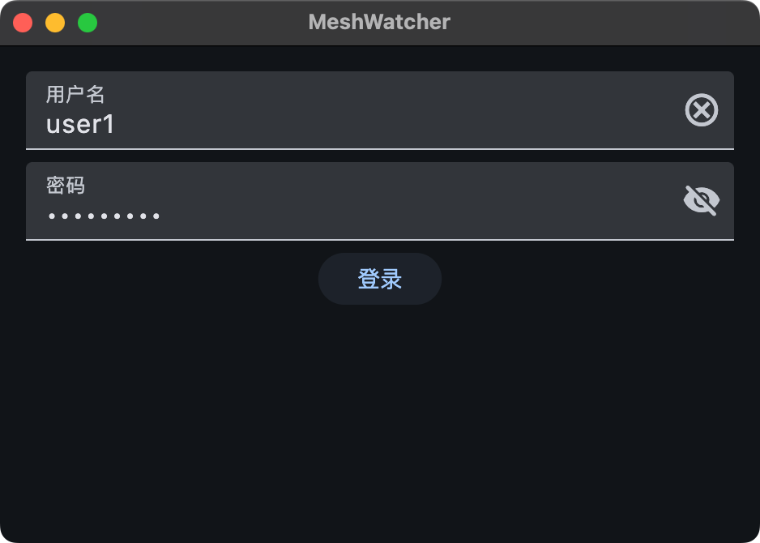
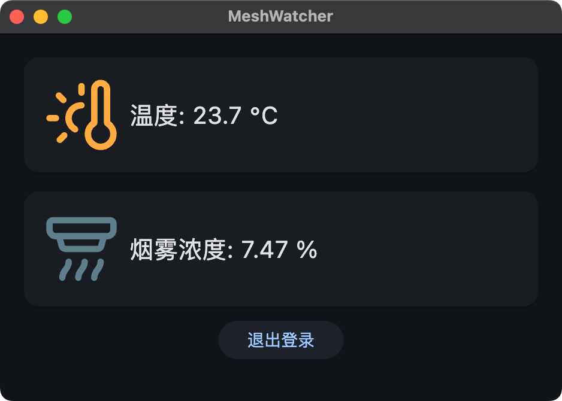
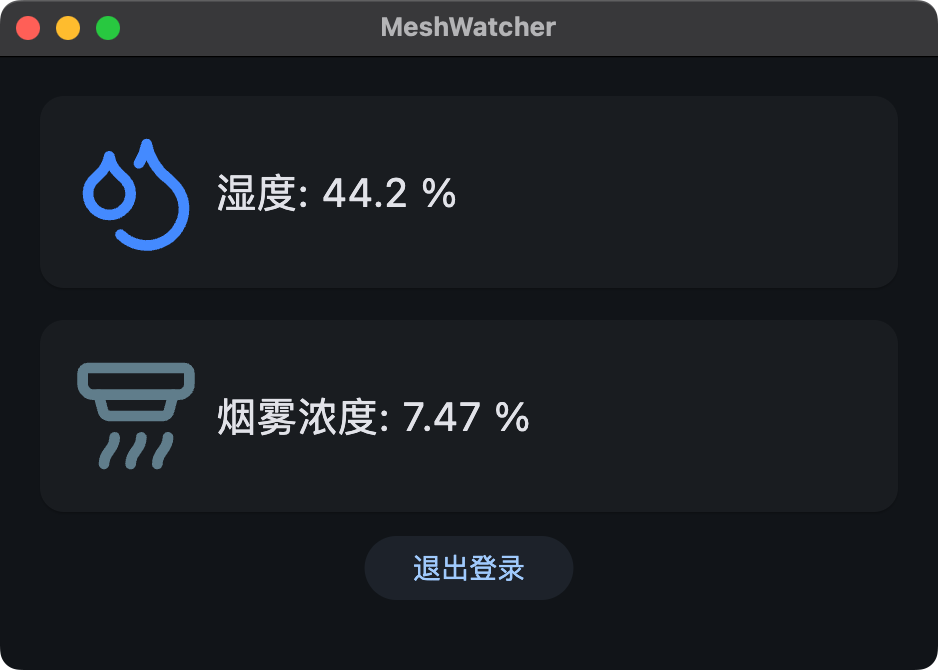
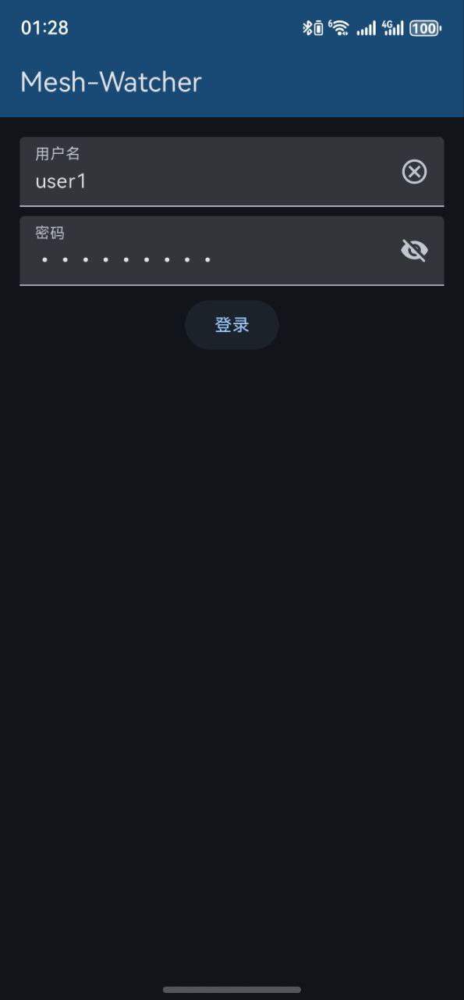
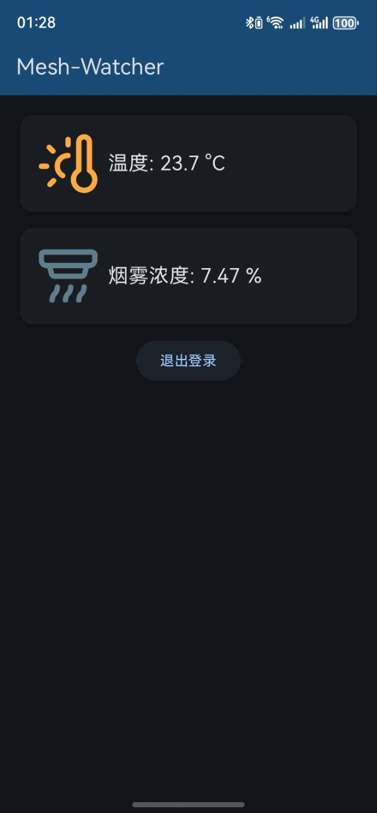
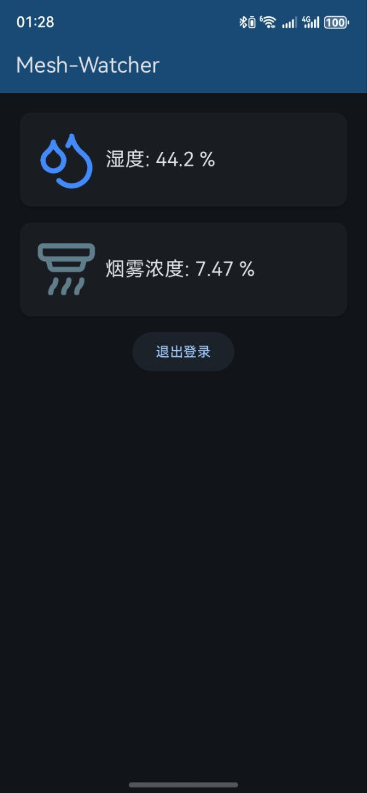

## MeshWatcher

基于 Flutter 的配套软件，支持用户鉴权、Token 自动缓存，刷新和账号本地存储。

登录 Token 及数据通过华为云提供的 API 获取。

使用 [OpenHarmony-SIG 组织的 Flutter 分支仓库](https://gitcode.com/openharmony-sig/flutter_flutter) 以支持 ohos。

|  |  |  |
|:------------------------:|:-----------------------:|:-----------------------:|
|  |  |  |

## API

可以通过 [Apifox](https://apifox.com/) 测试 API 的获取。

### 获取 IAM 用户 Token (用户密码)

文档：https://support.huaweicloud.com/api-iam/iam_30_0001.html

```http
POST https://iam.cn-east-3.myhuaweicloud.com/v3/auth/tokens
```

Body:

```json
{
  "auth": {
    "identity": {
      "methods": [
        "password"
      ],
      "password": {
        "user": {
          "name": "{iam_user_name}",
          "password": "{your_password}",
          "domain": {
            "name": "erbw_s"
          }
        }
      }
    },
    "scope": {
      "project": {
        "id": "{device_id}"
      }
    }
  }
}
```

Response 中的 `X-Subject-Token` 即为获取设备影子时需要的 Token

### 查询设备影子

文档：https://support.huaweicloud.com/api-iothub/iot_06_v5_0079.html

```http
GET https://iotda.cn-east-3.myhuaweicloud.com/v5/iot/{project_id}/devices/{device_id}/shadow
Header: X-Auth-Token: {your_token}
```

Response:

```json
{
  "device_id": "{device_id}",
  "shadow": [
    {
      "service_id": "sensors",
      "desired": {
        "properties": null,
        "event_time": null
      },
      "reported": {
        "properties": {
          "temperature": 23.7,
          "humidity": 44.2,
          "smoke": 7.47
        },
        "event_time": "20250404T074649Z"
      },
      "version": 84
    }
  ]
}
```

> [!IMPORTANT]
>
> 要从自己的华为云控制台获取域名！
